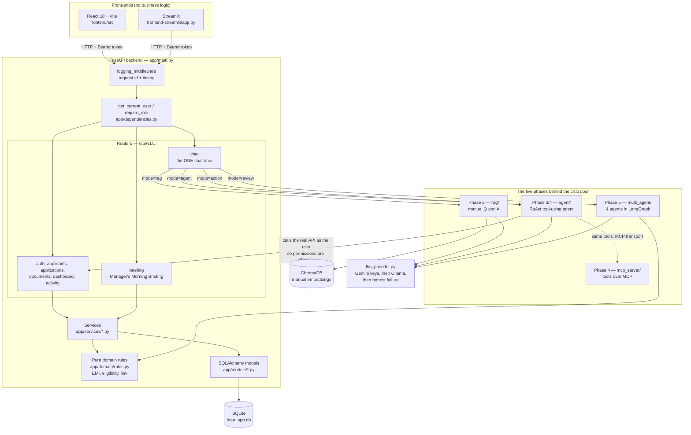

# Learning notes — understanding my own loan management system

A walkthrough of this codebase written so I can explain it out loud to a
Principal Architect, not recite it. Each section starts in plain language and
then has a **"Here's the precise/technical version:"** subsection where the
detail actually matters.

Sections get added one at a time as we work through them.

| # | Section | Status |
|---|---|---|
| 1 | High-level architecture | done |
| 2 | Where the "agentic" part actually lives | not started |
| 3 | Python fundamentals, in my own code | not started |
| 4 | Design decisions and the alternatives | not started |
| 5 | Quiz | not started |

---

## 1. High-level architecture

### The plain-language version

This is a loan application website for a bank, with AI features layered on top
of it. Strip the AI away and what is left is an ordinary web application, and
that ordering matters — it is the honest way to describe the project, and it is
also literally how it was built.

**The ordinary web application.** A customer signs up, fills in a loan
application, and uploads documents. Bank staff log in and see those
applications, move them through statuses, and eventually approve, reject or
disburse them. There is a database holding people, applications, documents and
a history of everything that happened. There is a login system that hands out a
token, and every request after that carries the token so the server knows who is
asking and what they are allowed to do.

**The AI on top.** Five separate capabilities were added in phases, and the
important architectural decision is that all five of them are reached through
**one single chat box**. The customer or the staff member types a sentence, and
something behind the scenes works out which of the five capabilities should
answer it:

| Phase | What it does | Example of what you would type |
|---|---|---|
| 1 | No AI. The website itself. | (clicking around the app) |
| 2 | Answers policy questions from the user manual | "What documents do I need for a home loan?" |
| 3 | Answers questions about live data by calling functions | "What is the status of application 7?" |
| 4 | Same tools, but served over a standard protocol, and can change records | "approve application 1, documents verified" |
| 5 | Four specialist agents review an application together | "assess application 7" |

**The three pieces you can point at.** There is a Python backend that holds all
the logic and the database. There is a React website that people actually click
on. And there is a second, simpler Streamlit front-end, which exists because the
trainer's tests check for it specifically. The React site and the Streamlit site
both talk to the same backend over HTTP, and neither of them contains any
business logic of its own.

**The one sentence version.** It is a FastAPI backend over a SQLite database,
with a React front-end, where five AI capabilities were added in phases and all
of them are reached through a single chat endpoint that routes the question to
whichever capability should answer it.

### Here's the precise/technical version:

**The package layout.** Under `backend/` there are five Python packages sitting
side by side, deliberately not nested:

| Package | Lines | Responsibility |
|---|---|---|
| `app` | ~3,600 | The Phase 1 web application: models, schemas, routers, services, auth |
| `rag` | ~500 | Phase 2. Ingests the user manual into a vector database, answers from it |
| `agent` | ~790 | Phase 3 and 4. The tool-using agent, its tools, its prompts |
| `mcp_server` | ~610 | Phase 4. Serves the same tools over Model Context Protocol |
| `multi_agent` | ~750 | Phase 5. Four agents in a LangGraph workflow |

They are flat rather than nested because the trainer's test files hardcode
import paths like `from agent.tools import ...`. The package names are fixed by
the tests, not chosen freely.

**The layering inside `app`.** It is a conventional four-layer web service, and
each layer has one job:

- **Routers** (`app/routers/*.py`) — the HTTP addresses. They parse the request,
  check permissions, call a service, and shape the response. They hold no
  business rules.
- **Schemas** (`app/schemas/*.py`) — Pydantic classes defining what a valid
  request body looks like and what the response body looks like. This is where
  input validation lives.
- **Services** (`app/services/*.py`) — the actual work. `application_service.py`
  is the largest at ~294 lines and owns the application lifecycle.
- **Models** (`app/models/*.py`) — SQLAlchemy classes, one per database table.

There is a fifth thing worth naming separately: `app/domain/rules.py`, 255 lines
of pure functions with no database and no framework in them. EMI calculation,
eligibility checks, risk scoring. It is pure because it has to be callable from
three completely different places — the web request path, the agent's tools, and
the Phase 5 agents — without dragging a database session along.

**Request lifecycle, precisely.** A request to a protected endpoint goes:

1. `logging_middleware` assigns a request ID and starts the timer
   (wired at `backend/app/main.py:72`).
2. FastAPI matches the route and resolves its dependencies **before** the
   endpoint function body runs.
3. `get_current_user` (`backend/app/dependencies.py:34`) reads the Bearer token,
   decodes it, loads the `User` row, and raises 401 if any step fails.
4. `get_db` (`backend/app/database.py:29`) yields a SQLAlchemy session and closes
   it in a `finally` block afterwards.
5. The endpoint body runs, calls a service, returns a Pydantic model.
6. FastAPI serialises it to JSON; the middleware logs the status and duration.

**The chat door.** `POST /api/v1/chat` is the single entry point for all five AI
phases — `backend/app/routers/chat.py`, 529 lines, the largest router in the
project by a wide margin. Its module docstring states the intent directly: each
phase replaces the brain behind the door, and no screen has to be rewritten.

The response carries a `mode` field saying which brain answered — `rag`,
`agent`, `action`, `review`, `empty` or `unavailable`. That field is what makes
the routing visible in the UI instead of magic, and it is a good architectural
answer to "how do you know what it actually did?"

**Two things worth knowing about how the routing works.** First, the Phase 5
review is triggered by a **typed phrase**, matched in Python, not by the model
deciding to run it. A ten-second four-agent review that sometimes fires and
sometimes does not is unacceptable during a live demo. Second, the agent is
**cached per role** (the `_agents` dict at `backend/app/routers/chat.py:71`),
because customers and staff get genuinely different toolsets. A customer's agent
does not even possess a tool that could change a record.

**Authorisation is not reimplemented for the AI.** This is the strongest
architectural point in the project. The agent's write tools call the real HTTP
API as the logged-in user, so a loan officer cannot disburse a loan through the
chat for exactly the same reason he cannot through the browser — the API refuses
him. The AI inherited Phase 1's permission system rather than getting its own
copy that could drift out of step.

### The diagram

### What I should be able to say out loud after this section

- It is a normal FastAPI web app with AI added in five phases on top.
- Four layers inside `app`: routers, schemas, services, models — plus a pure
  rules module with no framework in it, so three different callers can share it.
- All five AI phases sit behind one endpoint, `POST /api/v1/chat`, and the `mode`
  field in the response says which one answered.
- The agent did not get its own permission system. It calls the real API as the
  user, so Phase 1 authorisation applies unchanged.
